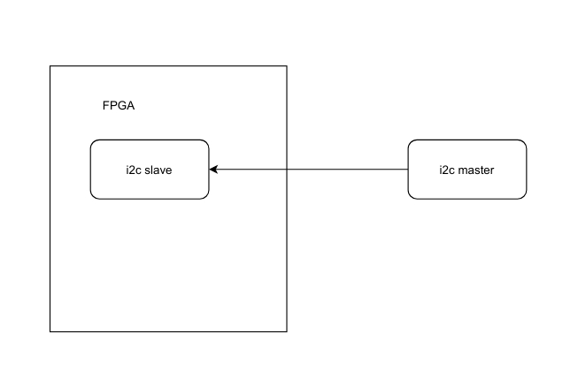
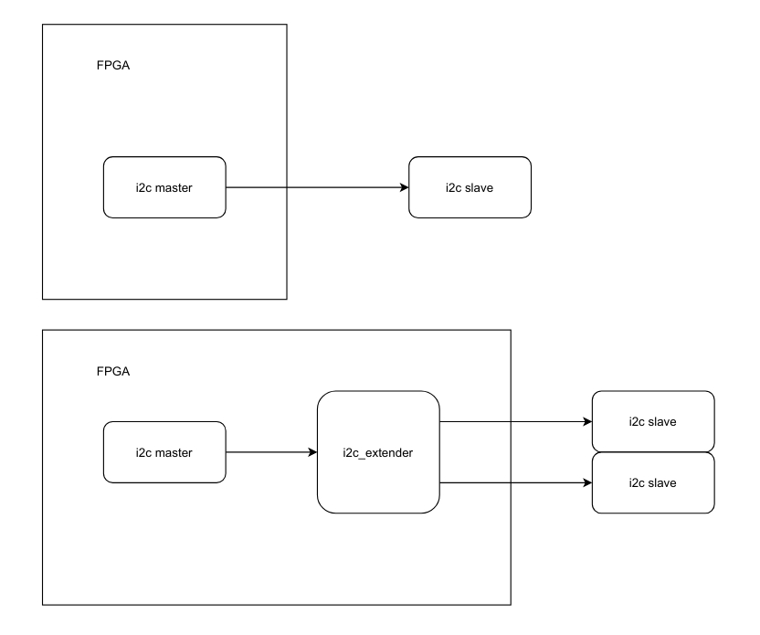
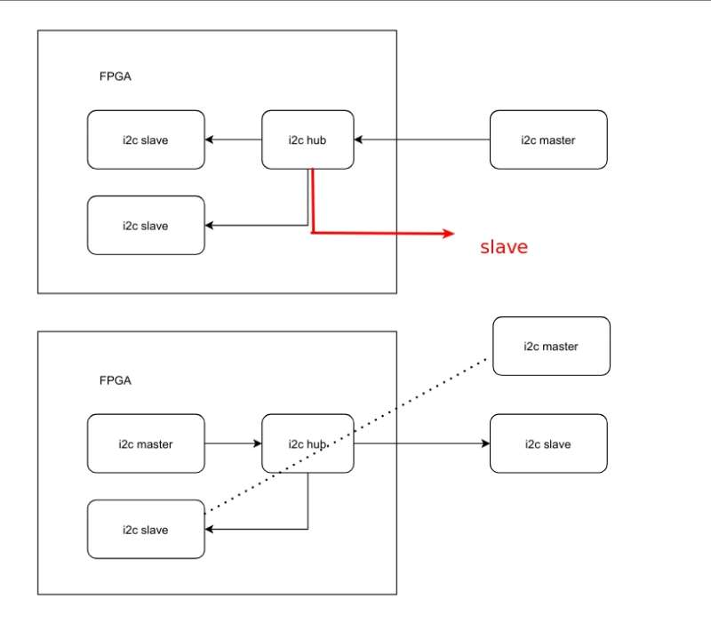

# i2c ips for vivado ip subsystem

All these simple ips aimed at making bd design easier.

## i2c_slave

make i2c_slave as a ip for vivado

## i2c_extender

i2c_extender makes a single master in fpga can access i2c device on diffierent fpga io

## i2c_hub

i2c_hub paly as one slave / tow (and more) master bridge.

